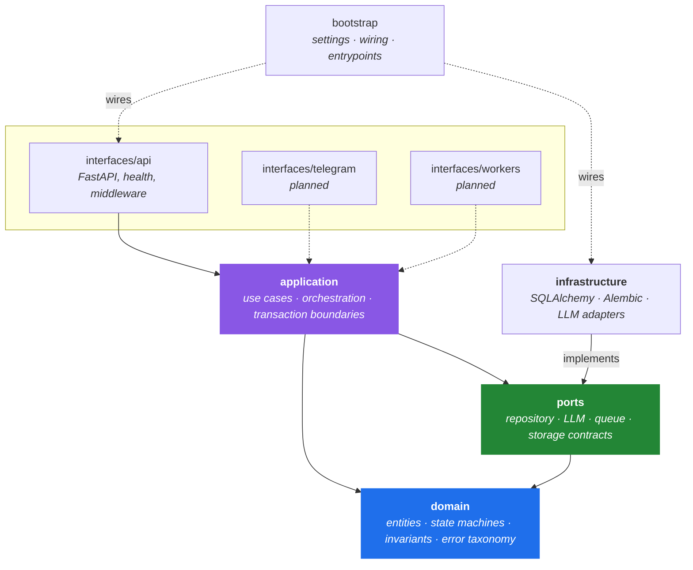

# NexaBot

**An AI assistant and automation platform, built as a modular monolith with
clean architecture — in Python 3.11+, FastAPI, SQLAlchemy 2 async, and Alembic.**

[](https://github.com/OWNER/nexabot/actions/workflows/ci.yml)
[](https://www.python.org/)
[](https://mypy-lang.org/)
[](https://docs.astral.sh/ruff/)
[](LICENSE)

> **بالعربية:** NexaBot منصّة مساعد ذكي وأتمتة، مبنيّة كـ *modular monolith*
> بمعمارية نظيفة. المشروع يركّز على ما يصعب إصلاحه لاحقاً: حدود المعاملات،
> سلامة التزامن، قيود قاعدة البيانات، والاختبارات. **[اقرأ التوثيق الكامل
> بالعربية ←](README.ar.md)**

---

## What this is

Telegram is *an* interface, not the product boundary. Domain and application
logic are kept independent of any delivery mechanism, so an HTTP API, a
dashboard, background workers, and a Telegram bot can all drive the same core.

This repository is the **foundation**: the architecture, the persistence layer,
the agent orchestration path, and the engineering discipline around them. It is
deliberately not a finished product, and the [status section](#status) says
exactly what exists and what does not.

## What it demonstrates

Every claim below is verifiable in the code — file references included.

| | |
|---|---|
| **Enforced layering** | `domain` depends on nothing; `application` on domain + ports; `infrastructure` implements ports. No SQLAlchemy, FastAPI, or provider SDK type appears above the infrastructure layer. |
| **Correct transaction boundaries** | The LLM call happens with **no database transaction open** — one unit of work persists the request, another persists the outcome. [`use_cases.py`](src/nexabot/application/agent/use_cases.py) |
| **Concurrency safety** | Idempotency uses claim tokens with compare-and-swap settlement, so a worker whose claim expired and was taken over cannot overwrite the newer attempt's result. [`idempotency.py`](src/nexabot/infrastructure/database/repositories/idempotency.py) |
| **Invariants in the database** | CHECK constraints mirror the domain entities — valid states, positive budgets, terminal-state completeness — so a bad backfill cannot create state the domain considers impossible. [`models.py`](src/nexabot/infrastructure/database/models.py) |
| **Migrations that are actually tested** | The chain runs up, reverses to base, and runs up again in CI, and the resulting schema is diffed against the ORM metadata. Model/migration drift fails a build, not a deploy. [`test_migrations.py`](tests/integration/test_migrations.py) |
| **Real resource limits** | Bounded LLM timeouts, a token *budget* (not a message count), input size ceilings, and paginated history windows. |
| **Errors that don't leak** | A typed domain error taxonomy mapped onto HTTP. Provider exception text is never persisted or returned; credentials are stripped from connection URLs in logs and settings output. |
| **Security by default** | The HTTP auth boundary **fails closed**: a route is unreachable until real authentication is wired, rather than silently open. No placeholder auth was written. [`security.py`](src/nexabot/interfaces/api/security.py) |

## Architecture



The dependency rule is one-directional: **nothing the domain knows about can
point outward.** Dashed edges are planned interfaces.

Full specification: [`docs/architecture/architecture.md`](docs/architecture/architecture.md) ·
Decision record: [`docs/architecture/adr/0001-modular-monolith-clean-architecture.md`](docs/architecture/adr/0001-modular-monolith-clean-architecture.md)

## Quick start

```bash
python3 -m venv .venv && source .venv/bin/activate && pip install -e ".[dev]"
```

Run the full quality gate — no database, no Docker, no network required:

```bash
pytest -q && ruff check . && mypy src migrations
```

To run the API against PostgreSQL:

```bash
cp .env.example .env   # then set DATABASE_URL
alembic upgrade head && nexabot-api
```

`DATABASE_URL` uses an async driver, so Alembic runs through an async engine —
a synchronous engine over `postgresql+asyncpg` fails at the first query.
`alembic.ini` deliberately carries no URL; `migrations/env.py` resolves it from
settings so no credential-shaped default lives in the repository.

Health endpoints: `GET /health/live` (process is up) and `GET /health/ready`
(dependencies reachable — 200 or 503). Readiness details are intentionally
coarse (`ok` / `timeout` / `unavailable`) because driver errors quote the DSN.

## Testing

**143 tests**, all offline. Tests run against in-memory SQLite via `aiosqlite`;
the repositories are plain SQLAlchemy Core/ORM with no PostgreSQL-specific
behaviour, so mapping, query, transaction, and constraint behaviour is all
exercised.

The suite is built around regressions rather than coverage percentage:

- Migration chain up → down → up, with an ORM-metadata drift check
- CHECK constraints asserted by inserting rows the domain considers impossible
- Idempotency claim lifecycle: original owner, expiry, reclaim, stale-owner
  settlement rejection, already-settled records, contended claimers
- Agent turn: ownership, deadline enforcement against a deliberately hanging
  provider, token-budget trimming, oversized input, provider-error redaction,
  and settlement on every failure path
- Auth boundary: protected routes unreachable without a wired authenticator

> **Not tested, and not claimed to be:** PostgreSQL, Redis, real LLM providers,
> and Docker. None are available in the development environment. Everything
> above runs on SQLite. This distinction is stated rather than blurred on
> purpose.

## Status

<a name="status"></a>

**Implemented** — validated configuration with fail-fast errors; domain error
taxonomy mapped onto HTTP; structured logging with secret redaction and
request-scoped trace context; health endpoints with a bounded readiness check;
migrations with database-enforced invariants; repositories for identity,
conversations, agent runs, and idempotency; bounded conversation loading;
idempotency with claim tokens; the `RunAgentTurn` orchestration path end to
end; graceful shutdown.

**Partially implemented** — the token budget is enforced against a conservative
*estimate* rather than a real tokenizer (no provider adapter exists to supply
one); run settlement covers every in-process exit path but not process death;
trace context is bound for HTTP requests only.

**Planned** — Redis queue, real LLM provider adapters, blob storage, tool
registry/executor, quota enforcement, audit logging, rate limiting, file
processing, and the Telegram interface.

**Known blockers before this could serve real traffic** — no HTTP
authentication (the boundary exists and denies by default; no credential model
has been chosen); no LLM provider adapter beyond the deterministic stub; no
reaper for runs interrupted by process death; no rate limiting; not yet
verified against PostgreSQL.

> Listing blockers in a portfolio README is a deliberate choice. Software that
> claims to be production-ready and isn't costs far more than software that
> says where it stands.

## Project layout

```text
src/nexabot/
├── domain/          entities, state machines, invariants, error taxonomy
├── application/     use cases, orchestration, transaction boundaries
├── ports/           protocols the infrastructure layer implements
├── infrastructure/  SQLAlchemy, Alembic, LLM adapters
├── interfaces/      FastAPI app, health, middleware, security boundary
├── config/          validated settings
├── observability/   structured logging, trace context
└── bootstrap/       dependency wiring, process entrypoints
```

## License

[MIT](LICENSE)
